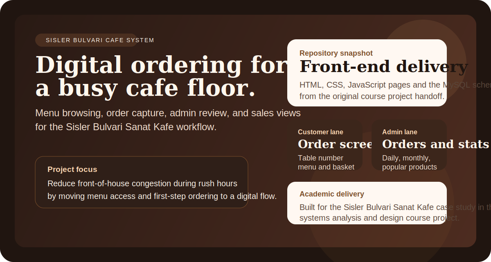
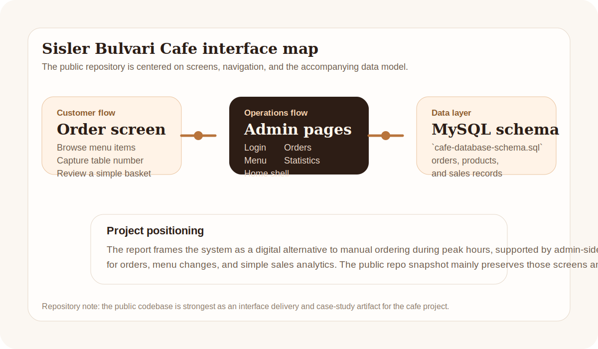

# Sisler Bulvari Cafe System

<p align="center">
  
</p>

<p align="center">
  
  
  
  
</p>

Sisler Bulvari Cafe System is a digital ordering and lightweight operations prototype prepared for Sisler Bulvari Sanat Kafe. The project focuses on reducing service friction during busy hours by moving menu browsing and order entry into a digital flow while giving staff a small admin surface for orders and sales views.

This README reflects both the academic report and the current public repository snapshot. The public codebase mainly contains the interface delivery and the MySQL schema, so the scope is described accordingly.

## What this repository includes

- Customer-facing order screen for table-side ordering
- Menu browsing surface for cafe items
- Admin-oriented pages for orders and internal navigation
- Daily, monthly, and popularity-focused statistics screens
- MySQL schema for the data model delivered with the project

## Included interface surfaces

- `login.html`: staff login entry point
- `order-screen.html`: customer/table order capture flow
- `menu.html`: menu rendering and item listing
- `orders.html`: order tracking surface
- `daily-stats.html`: daily sales view
- `monthly-stats.html`: monthly trend view
- `most-popular.html`: most popular products view
- `index.html`: home screen shell

<p align="center">
  
</p>

## Repository reality

- The report describes a wider system vision including Node.js connectivity and routed application flow.
- The current public repository snapshot primarily contains HTML, CSS, JavaScript pages and the SQL schema.
- The README therefore positions this repository as a front-end and data-model deliverable for the academic project, not as a fully packaged production stack.

## Why the project was built

The underlying problem was operational congestion during rush hours. Staff had to welcome customers, carry menus, take orders, deliver items, and reset tables in the same service window. The proposed system reduces that pressure by shifting menu access and initial order creation to a digital flow and by exposing basic analytics to the business owner.

## Academic context

- Course: `Bilisim Sistemleri Analizi ve Tasarimi`
- Project title: `Sisler Bulvari Sanat Kafe Akilli Siparis ve Kafe Yonetimi Sistemi`
- Team members: `Yusuf Yilmaz`, `Batuhan Yuksel`, `Savas Avci`, `Ekin Celik`
- Delivery year: `2025`

## Tech stack

| Area | Tools |
| --- | --- |
| Interface layer | HTML, CSS, JavaScript, Bootstrap |
| Charts | Chart.js |
| Data model | MySQL |
| Project method | Waterfall delivery approach described in the report |

## Repository structure

```text
.
|-- login.html
|-- index.html
|-- menu.html
|-- order-screen.html
|-- orders.html
|-- daily-stats.html
|-- monthly-stats.html
|-- most-popular.html
|-- cafe-database-schema.sql
|-- css/
|-- js/
`-- docs/assets/
```

## Running locally

Because the public snapshot is front-end focused, the fastest way to review it is to serve the files statically:

```bash
python3 -m http.server 8080
```

Then open `http://localhost:8080/index.html`.

If you want to inspect the original data model as part of the project handoff, import the schema:

```bash
mysql -u root -p sisler_cafe < cafe-database-schema.sql
```

## Notes on scope

- This repository works best as a product case study and interface delivery for the course project.
- The public snapshot is strongest on the ordering flow, page structure, and analytics concepts.
- A future iteration could consolidate the interface into a routed application and reconnect the missing backend pieces referenced in the report.

## License

Released under the [MIT License](LICENSE).
